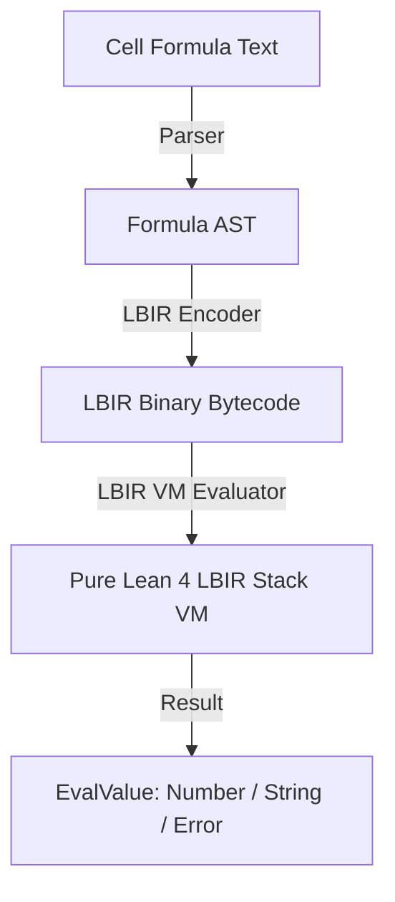

# JOffice: 02_LBIR_VM_AND_RECOMP_ENGINE.md

## 1. 概要
`02_LBIR_VM_AND_RECOMP_ENGINE` は、Excel の数式評価エンジン、Word のレイアウト・マクロ演算、Access のクエリ実行エンジンを統一的に駆動する LBIR (Lean Bytecode Intermediate Representation) VM 統合仕様を定義する。

---

## 2. LBIR バイトコードの対応関係

スプレッドシートの関数および数式（例: `SUM(A1:A10) + 10`）は、一度 LBIR の高密度バイナリバイトコードへとシリアライズされ、Pure Lean 4 の LBIR VM 上で評価される。

```lean
namespace JOffice.Lbir

import Lbir.Types

/-- JOffice の数式・セル評価値の型定義 -/
inductive EvalValue where
  | number (val : Float)
  | string (syms : Array UInt32)
  | boolean (b : Bool)
  | error (errCode : UInt16)
  deriving Inhabited, BEq

/-- セル再計算用依存グラフノード -/
structure CalcNode where
  cellId : UInt32
  exprBytecode : ByteArray
  dependencies : List UInt32
  cachedValue : Option EvalValue
  deriving Inhabited

/-- LBIR VM 実行コンテキストラップ -/
structure VMContext where
  stack : List EvalValue
  environment : Array EvalValue
  maxDepth : Nat

end JOffice.Lbir
```

---

## 3. 数式評価パイプラインと循環参照防止



1. **循環依存検出**: 再計算前にトポロジカルソートを実施。ソート不能（閉路検出）の場合、直ちに `EvalValue.error 0x0001` (Circular Reference) をバインド。
2. **スタック境界制御**: スタック深さ `maxDepth` を 1024 に制限。境界超過時は `LbirError.malformedStream` に基づき即座にエラーハンドリング。
3. **決定論的再計算**: キャッシュの不整合を回避するため、DAG (有向非巡回グラフ) の逆順で評価を伝播。
