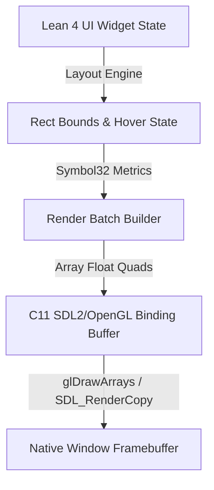

# JOffice: 04_XP_COMMANDBARS_AND_RENDERER.md

## 1. 概要
`04_XP_COMMANDBARS_AND_RENDERER` は、Office XP (2002) 特有のメタリック・フラットツールバー（CommandBars）、メニューバー、サイドタスクパン、ダイアログのスタイル再現仕様および Native 描画パイプラインを定義する。

---

## 2. Office XP UI デザインシステム仕様

### カラーパレット & グラデーション
- **CommandBar 背景色**: RGB(239, 237, 222) / 2-stop 垂直グラデーション RGB(255, 255, 255) → RGB(214, 210, 196)
- **フラットボタン Hover 枠線**: RGB(49, 106, 197)（Highlight Blue）
- **フラットボタン Hover 背景**: RGB(193, 210, 238)
- **フラットボタン Selected 背景**: RGB(152, 181, 226)
- **タスクパン Header**: RGB(122, 150, 223)

---

## 3. Pure Lean 4 GUI ウィジェット構造体

```lean
namespace JOffice.UI

open JOffice.Symbol32

inductive WidgetType where
  | menuBar
  | toolBar
  | taskPane
  | canvasArea
  | statusBar

structure Rect where
  x : Int32
  y : Int32
  width : UInt32
  height : UInt32
  deriving Inhabited, BEq

structure CommandButton where
  commandId : Symbol
  labelSyms : Array Symbol
  iconId : UInt16
  isHovered : Bool
  isPressed : Bool
  isEnabled : Bool
  bounds : Rect

structure CommandBar where
  id : Symbol
  isDocked : Bool
  position : Rect
  buttons : Array CommandButton

structure RenderBatch where
  quads : Array Float  -- [x, y, w, h, r, g, b, a, u, v]
  symbolGlyphs : Array UInt32
```

---

## 4. Native 描画バッチ構築パイプライン (SDL2 / OpenGL)



1. **イベントループ受領**: マウス移動・クリックイベントを SDL2 から Pure Lean 4 の UI State ディスパッチャへ伝播。
2. **Hover / Active 状態更新**: 影響を受ける `CommandButton` のフラットボタン描画フラグ（Hover/Pressed）を切り替え。
3. **頂点バッチ (`RenderBatch`) 生成**: クワッド（矩形）描画データと Symbol32 テクスチャ座標を配列へバッチ化。
4. **描画命令発行**: FFI 経由で C11 描画バッファ（OpenGL/SDL2）へ転送し、フレームバッファを描画。
