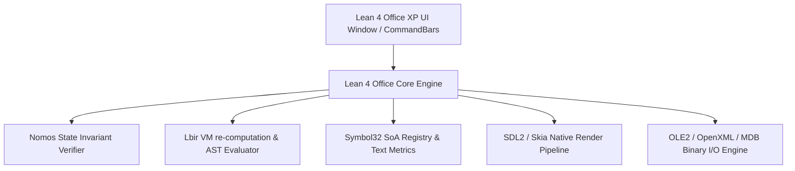

# JOffice: システムアーキテクチャ設計書および基本計画

## 1. 概要と目標
`JOffice` は、Microsoft Office XP (2002) との完全機能互換・完全UI互換を達成するオフィススイート（Word / Excel / PowerPoint / Access）である。
本システムは、**Pure Lean 4** を基盤言語とし、内部文字・メタデータ表現に **Symbol32**、命令・数式・バイトコード実行評価に **Lbir**、状態遷移と不変条件の形式検証に **Nomos** を全面的に採用する。

---

## 2. コア技術スタックとその役割

### 2.1 Symbol32 (文字・メタデータ基盤)
- 画面上の全文字、ドキュメント属性、UIコマンドID、スタイル定義を `uint32_t` 固定長不変シンボルとして一元管理。
- `.sreg` (SoA Registry) をゼロコピー読み込みし、$O(1)$ で Glyph Metrics、FeatureMask、Unicode相互変換を取得。

### 2.2 Lbir (Lean Bytecode Intermediate Representation)
- Excel 再計算エンジン、Word レイアウト計算、Access クエリ評価エンジン等の動的評価機構を Lbir VM（Pure Lean 4）へ統一。
- バイナリ AST から直接 `CoreM` / `Lean.Expr` へブリッジし、型安全かつ高速に命令を実行。

### 2.3 Nomos (形式検証契約・不変条件)
- ドキュメント DOM / スプレッドシートモデルの状態遷移（Undo/Redo、並行処理、ファイル保存）に対し `Law over Logic` を適用。
- 非破壊保存、循環参照による無限ループ不在、バッファオーバーフロー不在を Lean 4 定理として検証。

### 2.4 Pure Lean 4 Native Renderer & Widget System
- OS依存を排した C11 (SDL2/Skia/OpenGL) 最小描画バインディング。
- Pure Lean 4 上で Office XP 特有のメタリック・フラットツールバー（CommandBars）、タスクパン、メニューバー、ダイアログを構築。

---

## 3. レイヤーアーキテクチャ (C4 Level 2)

---

## 4. 開発・検証フェーズ (VFR & シナリオテスト)

1. **フェーズ 1: ドキュメント AST と Symbol32 / Lbir 基礎結合**
   - Symbol32 による文字列管理モジュールおよび Lbir による評価エンジンの構築。
2. **フェーズ 2: Office XP UI Engine (CommandBars) の Pure Lean 4 実装**
   - ツールバー、メタリックグラデーション、ドッキング、メニュースタックの Lean 4 描画ロジック作成。
3. **フェーズ 3: Word / Excel / PowerPoint / Access 個別機能コア**
   - Binary OLE2 (doc/xls/ppt/mdb) および OpenXML (.docx/.xlsx/.pptx) デコーダ・エンコーダ。
4. **フェーズ 4: Nomos による形式検証と E2E シナリオテスト**
   - 壊れたファイル投入時や複雑な数式循環時の決定論的挙動証明と、実際の画面描画・保存ロードを網羅する総合テストの実施。
